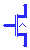
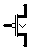
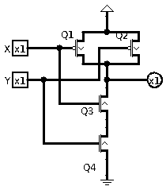
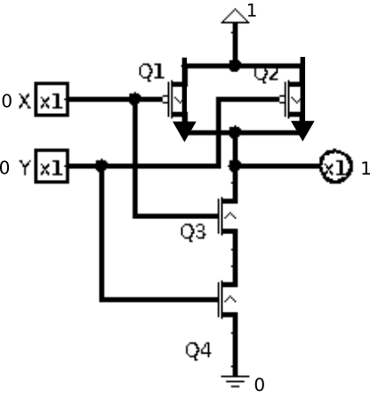
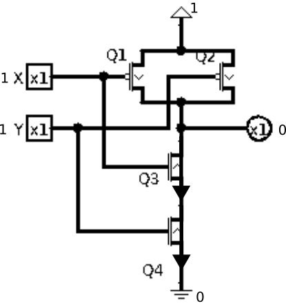
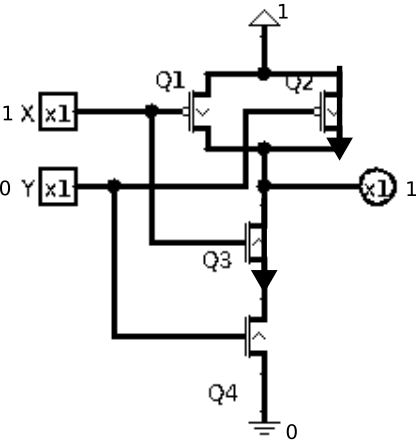

# About this module

-   Prerequisites:

-   Objectives: This module is an introduction to the essential material
    of CISP310.

# Physical states

## Physical devices

It makes sense to start with devices that are physical. These devices
are/were used to implement computers at one point of time or another.

### Electro-mechanical

A electro-mechanical device is one that uses electricity to physically
(mechanically) actuate/move contacts. A motor drives a rotor. On each
rotor are contact points at different rotational positions. The rotor
then connects different electrical contact points on the stator.

A electro-mechanical computer is extremely bulky due to the use of
rotors, plug boards and motors. The use of motors (to change state by
changing the rotational state of rotors) is also very slow compared to
other mechanisms. However, given the right circumstances, a
electro-mechanical computer can be worthwhile.

At the end of World War 2, German Enigma encryption machines received a
fourth wheel to scramble broadcast communication. This made the previous
manual deciphering method no longer effective. The bombe computer was
devised to semi-automate the deciphering process. Despite being one of
the slowest mechanisms, electro-mechanical bombe proved to be effective
against the Enigma encryption machines.

### Vacuum tubes

A is, as the name implies, a glass tube that is *mostly* vacuum inside.
At the center of a vacuum tube is a heating element that is not unlike
the filament of an incandescent light bulb. The heating element heats up
the next layer that is known as the cathode. The cathode must be
sufficiently heated in order for electrons to become mobile.

Depending on the device, there is at least one but potentially more
layers outside the cathode. For our discussion, a has two layers outside
the cathode. The immediate next layer is a mesh-like gate, and the
outermost layer is a solid plate anode.

The main idea is that a triode vacuum tube is a valve. The heating
element should always be on because that is how the cathode works. A
negative electrical potential (voltage) is applied to the cathode. A
positive electrical potential is applied to the anode.

In the absence of a gate or no voltage at the gate, electrons are
emitted from the cathode and go to the anode. As a result, there is
electrical current.

However, by using a relatively low negative voltage at the gate, the
current passing through can be reduced. The voltage difference between
the cathode and anode is in the order of 100Vs, while the gate voltage
is in the order of 1Vs.

Essentially, a triode is a non-mechanical and non-hydraulic valve. The
key concept, however, is that the control mechanism of the valve uses
the same physics (electrical) as the quantity being controlled.

Bulky, hot, energy consuming, vacuum tubes are components that make
rather large computers. Furthermore, due to the large surface areas of
the cathode and anode, vacuum tubes are also relatively slow devices.
Nonetheless, computers made from vacuum tubes have no moving mechanical
components, and thus a big improvement in terms of reliability and
speed.

Although there were computer prior to the Colossus, the Colossus is one
of the most recognized vacuum tube computers due to its role also at the
end of World War 2. The Colossus was invented to decipher message
encoded by . The Lorenz cipher is considerably more complex (and
expensive) compared to the Enigma machines. As such, the Lorenz cipher
was only used for "ultra" secret communication. But this also made it a
high priority target to crack.

### Transistors

A transistor is a general term for devices that make use of
semiconductor material. A semiconductor material is actually a
non-conducting material "" with other elements. For example, Silicon
(Si) does not conduct electricity. However, when elements like boron and
phosphorus, the material conducts due to the charged carrier (either as
holes or electrons).

The term semiconductor implies the material can conduct or *not* to
conduct. This is due to the most basic semiconductor construct, the PN
junction. A PN junction is one that allows the flow of current in only
one direction.

A transistor is a mechanism that is based on the simple PN junction. The
physics is a bit beyond the scope of this module. From the external
perspective, however, a transistor is like a vacuum tube. A small signal
can be used to control a valve that switches the flow of a much bigger
signal. In this case, both the control signal and the signal being
controlled are electrical.

Even the original transistors are a bit smaller than vacuum tubes in
size. Furthermore, because there is no need to encourage electrons to
fly through vacuum, the operating electrical potentials of transistors
are considerably less than those of vacuum tubes.

As a result, computers made from transistors are much smaller than those
made from vacuum tubes, require far less energy and operate faster as
well.

There are several revolutions in terms of transistor technologies. For
this module, there will be no discussion of the various types of
transistor nor the packaging of transistors.

## Physical states

Regardless of the physical mechanism, all types of computer components
have "states". Since we are focusing on digital and binary computers,
components are only in one of two states. Because almost all devices
used to make computers can be seen as valves, we can see the state of a
device as allowing flow (closed) or not allowing flow (open).

Likewise, we can also measure physical quantities as the outputs of
devices. For electronic or electro-mechanical devices, this often means
measuring the electrical potential of a electrical contact point. Again,
because our focus is on digital and binary computers, the electrical
potential is either high or low.

There is nothing mysterious about physical devices, their actual states
or their observable states. After all, it is all physics!

# Truth

Computer science is not a science because it has nothing to do with the
truth (of nature). Instead, it is a study of implications of artificial
rules regarding truth values.

How does this relate to physical devices and physical states? Easy!
Since a device has two states (either observable like voltage or actual
like allowing flow), it is understandable that we can *assign* truth
values to the states. For example, we can *arbitrarily* assign "true" to
a high voltage and "false" to a low voltage. There are times when the
truth assignment is reversed.

But what does this buy us? There is nothing to gain by randomly labeling
truth values to physical states. However, what if we can design
circuitry so that the circuitry mimics logical operations?

Let's see how this works.

## Transistor types

Not going into the specifics, let us discuss *how to use* two types of
transistors. Note that there is an alternative description of
transistors in the Logisim. Go to Help \| Library Reference \|
Transistor.

The first type is the more intuitive type. We will call this an N
transistors. In real circuits, an N transistor can be a BJT (bi-polar
junction transistor) or a MOSFET (metal oxide semiconductor field effect
transistor). Regardless of the type, a high voltage control signal turns
on the valve to allow flow, and a low voltage control signal turns off
the valve to stop flow.

For an N-transistor, the arrow goes from low voltage to high voltage,
while the pin perpendicular to the direction of the arrow is the gate
(control signal). Unlike a general purpose valve, an N-transistor only
let flow from low voltage to high voltage.

The second type has a negated control signal, meaning a low voltage
turns on the valve and a high voltage turns off the valve. This type of
transistor is a P transistor. Again, A P transistor can be a BJT or a
MOSFET. In the diagram of a P-transistor, the arrow has to go from high
voltage to low voltage. The bubble indicates that the control signal is
negated where a low voltage at the gate enables flow from high voltage
to low voltage.

To clarify a potential confusion, in both N or P transistors, the arrow
indicates the flow from the "source" to the "drain". However, in the
case of an N transistor, the source is a low voltage (ground), whereas a
P transistor has the high voltage (usually called "power" or VCC) as
source. The gate is the control signal to allow or block flow. A bubble
in a circuit schematic usually indicates negation.

## A 2N2P circuit

Now let us analyze the circuit in figure
[1](#fig:nand2){reference-type="ref" reference="fig:nand2"}.

<figure id="fig:nand2">

 

<figcaption>Circuit using 4 transistors.</figcaption>
</figure>

First of all, a solid dot means there is connection at a junction.
Otherwise, if two wires crosses without a solid dot, the wires are not
connected. The input pins are square, indicating the voltage is to be
specified by something else. The single output pin is circular,
indicating the voltage is the result of whatever connects to it.

There are four transistors, Q1 to Q4 in this circuit. Note how Q1 and Q2
are P transistors, while Q3 and Q4 are N transistors. Furthermore, the
gates of Q1 and Q3 are connected to input X, while the gates of Q2 and
Q4 are connected to input Y.

Instead of actually quantifying X and Y in voltages, let's just assign a
value of 1 to a high voltage, and a value of 0 to a low voltage. The
same applies to the output and all the other "nodes" of this circuit. A
"node" is a term that refers to all the wires that are electrically
connected and therefore logically the same conductor.

First of all, see how the arrows of Q1 and Q2 are in opposite direction
from those of Q3 and Q4? This is not a mistake. This is because in the
case of a P transistor, the "source" is the high voltage end, whereas in
the case of an N transistor, the "source" is the low voltage end. Also,
note the bubble that is at the gate pin of Q1 and Q2. This signifies
that the input is negated, when the input is a 0, the transistor is
turned on (allowing electrical current through).

Now our task is to figure out the state of the output pin (the circular
object all the way to the right) depending on the inputs X and Y.

In the first case, let X and Y both be zeroes. This turns on both Q1 and
Q2, connecting the output pin to the high voltage source. There is no
path to connect to the low voltage source because Q3 and Q4 are both
disabled (not connecting). This is illustrated in figure
[2](#fig:2n2p00){reference-type="ref" reference="fig:2n2p00"}.

<figure id="fig:2n2p00">

 

<figcaption>Circuit using 4 transistors with inputs 0 and
0.</figcaption>
</figure>

In the second case, let X and Y both be ones. This turns off both Q1 and
Q2 so that the output is no longer connected to the high voltage source.
However, Q3 and Q4 are turned on, completing a path from the output pin
to the low voltage source. This is illustrated by figure
[3](#fig:2n2p11).

<figure id="fig:2n2p11">

 

<figcaption>Circuit using 4 transistors with inputs 1 and
1.</figcaption>
</figure>

The last two cases are symmetric where one input is 1 and the other one
is 0. We will illustrate the one where X is 1 and Y is 0. In this case,
Q1 is off, Q2 is on, Q3 is on and Q4 is off. Because Q1 and Q2 are in
parallel, having at least one connecting means the output connects to
the high voltage source (via Q2 in this case). On the other hand, Q3 and
Q4 are in series, both need to connect to complete a path to the low
voltage source. Since only Q3 is connecting but Q4 is not connecting,
there is no path to connect the output pin to the low voltage source. As
a result, the output pin has a high voltage. This is illustrated in
figure [4](#fig:2n2p10)

<figure id="fig:2n2p10">

 

<figcaption>Circuit using 4 transistors with inputs 1 and
0.</figcaption>
</figure>

## From transistors to logic gate

This is one of the key "ah-ha" moments of this modules. At this point,
the circuitry previous analyzed can now be considered a logic gate. This
is a rather important transition.

The circuitry that is made of 2 N-transistors and 2 P-transistors is a
*physical* thing that has known physical properties. However, I now
claim that this circuitry mimics/implements the behavior of a *logical*
construct. But which logic operator is this?

Let us first example the behavior of the circuit using a table.

|X|Y| output|
|-|-|-------|
|0|0|     1|
|1|1|     0|
|1|0|     1|
|0|1|     1|

At first glance, because there are three 1's and one 0, we may think
this is disjunction (or). But it is not! You can see that the output is
1 whenever at least one input is a 0 (instead of a 1 in the case of
disjunction). As it turns out this logical operator is a seemingly weird
one called a negated-and, often abbreviated to nand.

If we denote the output as W, then `W=!(X && Y)` in C/C++ syntax, or
$W=\neg(X \wedge Y)$ in math symbols, or $W=\overline{X\cdot Y}$ in
computer engineering notation, or $W=\overline{XY}$ in abbreviated
computer engineering notation, or simply `W=not(X and Y)` using plain
text.

## Nand is all we need!

Some may be thinking what practical use does nand as operator has. Well,
it is actually the only operator that we need! Let us examine how nand
can be used to "emulate" all the common logic operators that we have
learned.

The nand operator is sometimes denoted as $\uparrow$.

### not

This one is easy, but it is also a little tricky:

$\neg X = X \uparrow X$

Note that the negation of $X$ can also be denoted as `!X` in C++ syntax,
or $\overline{X}$ in computer engineering notation, or `/X` in
electrical engineering notation.

### and

Once we have negation, the negation of nand is and:

$X \wedge Y = (X \uparrow Y) \uparrow (X \uparrow Y)$

Note that the conjunction of $X$ and $Y$ can also be denoted as `X && Y`
in C++, or $X \cdot Y$ in computer engineering notation, or $XY$ is
abbreviated computer engineering notation.

### or

Or is a little tricky because we have to use De Morgan's law in this
case.

$X \vee Y = \neg(\neg(X \vee Y)) = \neg((\neg X \wedge \neg Y)) = \neg X \uparrow \neg Y = (X \uparrow X) \uparrow (Y \uparrow Y)$

Note that the disjunction of $X$ and $Y$ can also be denoted as `X || Y`
in C++, or $X+Y$ in computer engineering notation.

### Oh, really?

You can use truth tables to show validity of the nand emulation of all
other commonly used gates. This is a good exercise to make sure your
understanding of the nand gate is correct.

# Numbers and values

In this module, we are only going to say this: a number is a
representation of a value (quantity). Numbers are necessary so that
people can mutually understand the concept of quantities so that trade
and other quantity related activities can take place.

In other words, if you consider yourself (as a person) as a quantity,
then your name is the number corresponding to that quantity. For those
who have multiple names, all those names refer to the same person!

This implies that the same quantity may have different "names", or
numbers corresponding to it. We will explore this in another module.

At this point, let us just consider the translation from voltages to
numbers: a high voltage represents 1, and a low voltage represents 0.
