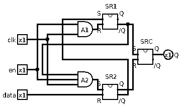
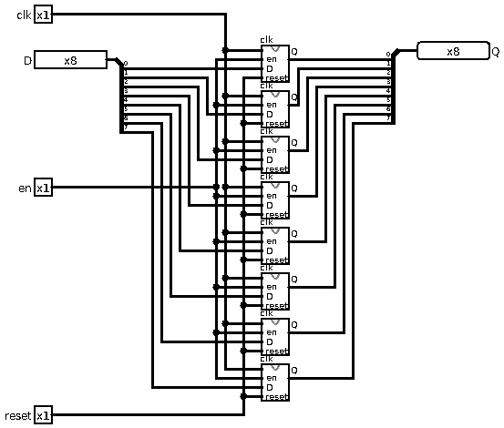

# _{{ page.title }}_

# About this module

-   Prerequisites:

-   Objectives: This module explores the most basic memory devices
    implemented in logic gates, including the flexible D-flipflop.

# What is a memory device?

A logic gate is not a memory device because the state of the output
changes as the inputs change. A memory device has a guarded internal
state that remains unchanged until a specific input pattern triggers the
change.

# SR Latch

A "latch" is a basic memory device because its state is latched unless
there is an explicit signal to change the state. Let us examine the
basic logic design of an SR-latch.

Instead of using a diagram to represent the logic design, let us use an
alternative description. In this description language, we borrow ideas
from C/C++ programming, but we also add some unique elements so that it
is useful in circuit description.

First, we can see gate *types* as classes. For example, `Nand2` refers
to the class describing the properties and behavior of a nand2 gate.
Let's see whether the following description works:

```c
Nand2 n1, n2;
    InputPin s, r;
    OutputPin q, nq;
    circuit.addNode(new Node(s.pin, n1.in[0]));
    circuit.addNode(new Node(r.pin, n2.in[1]));
    circuit.addNode(new Node(n1.out, n2.in[0], q.pin));
    circuit.addNode(new Node(n2.out, n1.in[1], nq.pin));
```

A "node" in a circuit diagram represents a logical electrical
connection. A node connects "ports" of circuit components. In the above
description, "n1" and "n2" are nand2 gates. "s" and "r" are input pins,
"q" and "nq" are output pins.

Our first exercise is to draw a diagram of this circuit.

Once the diagram is drawn, you may notice that this circuit is different
from most of the other circuits like adders and subtractors. A carry
lookahead adder may be complex, but it has no "loops"!

The loop nature of an SR latch is exactly the reason why it is a basic
memory device. The output states feeds back to the input state to
reinforce/maintain the state of the device. This allows the circuit to
ignore certain input states while maintaining the output states.

Let us start our analysis of this circuit with input states that
guarantees some output states:

-   `s.state = 0`{.c} makes `s.pin == 0`{.c}. Since `s.pin` connects to
    `n1.in[0]` , `n1.out` becomes 1.

-   `r.state = 0` makes `r.pin == 0`. Since `r.pin` connects to
    `n2.in[1]`, `n2.out` becomes 1.

Now let us examine the following sequence of state changes:

-   `s.state = r.state = 0`: this sets both output pins to 1.

-   `r.state = 1`: because `s.pin == 0`, `n1.out == n2.in[0] == 1`.
    Combined with `r.pin == n2.in[1] == 1`, `nq.state == 0`.

-   `s.state = 1`: because `n2.out == n1.in[1] == 0` at this point, even
    if `s.pin == n1.in[0] == 1`, `n1.out == 1`.

Now compare to this sequence of input pin state changes:

-   `s.state = r.state = 0`

-   `s.state = 1`

-   `r.state = 1`

By reversing the ordering of letting the input pins return to 1, the
output of the device is different! This is despite in both sequences we
end up with `s.state == r.state == 1`. The ability of an SR latch being
able to latch to different output states despite the same input states
has to do with the feedback mechanism so that the output states forms an
internal feedback to the input to maintain certain output states.

This means the truth table of an SR latch is a bit trickier than other
circuits:

   s   r   q    nq
  --- --- ---- ----
   0   0   1    1
   0   1   1    0
   1   0   0    1
   1   1   NC   NC

The last row of the truth table says "q and nq maintains their original
states, no change (NC)".

The names of the devices are actually significant. "s" means "set", "r"
means "reset". "q" is the main output of an SR latch, "nq" is basically
"not q", the negated output.

You may also notice that "s" is an "active low" signal. This means that
when the signal is low (0), it sets "q". This is why often times "s" as
a pin is also written as "/s" where the slash symbol represents
negation. The same applies to "r".

While being crude, an SR latch is a memory device because of its ability
to remember its state when both inputs are 1. As a result, SR latches
form the foundation of more complex and flexible memory devices.

Let us conclude this section defining the ports of a SR-Latch:

-   `SRLatch.s`: the active low input to set the latch.

-   `SRLatch.r`: the active low input to reset the latch.

-   `SRLatch.q`: the output/state of the latch.

-   `SRLatch.nq`: the negated output/state of the latch.

An interesting question is what if the input of an SR latch changes from
`s==r==0` to `s==r==1` simultaneously?

Because a real NAND2 device has a latency and does not respond to input
changes simultaneously, there is a delay from the time the input
experiences a change to the output reflecting the change. Let us assume
"n1" has a latency of $t_1$ while "n2" has a latency of $t_2$. The
overall time is $t$. For this discussion, assume $t_1 < t_2$.

-   at time $t=0$, both `n1,in[0]` and `n2,in[1]` transition from 0 to
    1.

-   at time $t=t_1$, `n1.out == 0` responding to the event at time
    $t=0$.

-   at time $t=t_2$, `n2.out == 0` responding to the event at time
    $t=0$.

-   at time $t=t_2+t_1$, `n1.out == 1` responding to the event at time
    $t=t_2$, but at the same time, `n2.out ==1` responding to the event
    at time $t=t_1$.

-   back to the first step!

'

This is called an oscillation!

# D-flipflop

A D-flipflop is a memory device that is built on top of an SR-latch.
Unlike an SR-latch, a D-flipflop has a data bit (hence the name D) that
specifies the value to store (1 or 0), and a separate "clock" that
serves as the enabler to change the state of the SR-latch.

The following is the text description of a D-flipflop:

        Not n;
        Nand2 n1, n2;
        SRLatch sr;
        InputPin d, en;
        OutputPin q,nq;
        circuit.addNode(new Node(d.pin, n1.in[0], n.in));
        circuit.addNode(new Node(en.pin, n1.in[1], n2.in[0]));
        circuit.addNode(new Node(n.out, n2.in[1]));
        circuit.addNode(new Node(n1.out, sr.s));
        circuit.addNode(new Node(n2.out, sr.r));
        circuit.addNode(new Node(sr.q, q.pin));
        circuit.addNode(new Node(sr.nq, nq.pin));

Because "en" connects to both "n1" and "n2" (the NAND2 gates), when "en"
is a 0 (not enabled), the outputs of "n1" and "n2" guarantee to be 1's.
From the SR-latch discussion, having both inputs to an SR latch being
1's maintain the current state. This is why "en" is called the "enable"
pin. When `en.state == 0`, the SR-latch "sr" just maintains its state.

When "en" is 1, however, then the actual output of "n1" and "n2" is
decided by the other input of each of the NAND2 gates. The other input
to the NAND2 gates are the "data" and the negation of the "data". This
means exactly one of the NAND2 gates outputs a 1 and other one outputs a
0. The one that outputs a 0 (because both inputs are 1s) alters the
state of the SR-latch accordingly.

The key feature of a D-flipflop is that an input port is dedicated to
specify the new state of the memory unit, whereas the other input port
is dedicated to enable/disable the update. This means a bank of
D-flipflops can be used to store multiple bits sharing the same enable.

# Edge sensitive D-flipflop

The design in section [D-flipfop](#d-flipflop) is "level sensitive" because the
state of the SR latch keeps updating according to the data port as long
as the enable port is a 1. This is often not desirable in a practical
design where multiple memory devices share the same data nodes.

An edge-sensitive design updates at the exact moment of the transition
of a "clock" or "clk" port. The "edge" is a transition from 0 to 1 or a
transition from 1 to 0. Most designs are sensitive only to one edge
(rising edge 0 to 1, or falling edge 1 to 0).

The following is the design of a positive-edge sensitive D-flipflop:

```c
        SRLatch s, c;
        Nand3 n1;
        Nand2 n2
        InputPin clk;
        InputPin data;
        OutputPin q;
        circuit.addNode(new Node(data.pin, n2.in[1]));
        circuit.addNode(new Node(clk.pin, s.r, n1.in[1]));
        circuit.addNode(new Node(n2.out, n1.in[2], s.s));
        circuit.addNode(new Node(n1.out, n2.in[0], c.r));
        circuit.addNode(new Node(s.nq, n1.in[0],c.s));
        circuit.addNode(new Node(c.q, q.pin));
```

Again, a good exercise is to draw the actual design in a circuit
diagram.

This design is a little more difficult to analyze because the key is the
transition of clk from 0 to 1.

The analysis is divided into several sections.

## data=0 clock rising edge

-   `clk.pin == 0, data.pin == 0`:

    -   `s.r  == 0`, causing `s.nq == c.s == 1`.

    -   `n1.in[1] == 0`, causing `n1.out == c.r == 1`

    -   SR latch "c" maintains its state

-   `clk.pin == 1, data.pin == 0`:

    -   `s.s == 1, s.r == 1`, therefore `s.nq == c.s == 1` is
        maintained.

    -   `n1.[0] == s.nq == 1`, `n1.[1] == 1`, `n1.[2] == n2.out == 1`,
        therefore `n1.out == c.r == 0`, this causes
        `c.q == 0, c.nq == 1`

## data=1 clock rising edge

-   `clk.pin == 0, data.pin == 1`:

    -   `s.r  == 0`, causing `s.nq == c.s == 1`.

    -   `n1.in[1] == 0`, causing `n1.out == c.r == 1`

    -   SR latch "c" maintains its state

-   `clk.pin == 1, data.pin == 1`:

    -   `n2.out == n1.in[2] == 0`, therefore `n1.out == c.r == 1`. We
        know SR latch "c" is not resetting.

    -   `s.s == n2.out == 0`, as a result, `s.nq == c.s == 0`, this
        causes the SR latch "c" to turn on, resulting in `c.q == 1`

## clk steady state insensitivity

It is fairly clear that when `clk.pin == 0`, `c.s == c.r == 1`, which
means the value of `data.pin` has no impact to the system.

However, we also have to show that when `clk.pin == 1`, transitions of
`data.pin` does not affect the output of the SR latch "c".

To perform this analysis, we start with the `clk.pin == 1` state of the
previous section.

After a rising clock edge when `data.pin == 0`:

-   `clk.pin == 1, data.pin == 0`:

    -   `s.s == 1, s.r == 1`, therefore `s.nq == c.s == 1` is
        maintained.

    -   `n1.[0] == s.nq == 1`, `n1.[1] == 1`, `n1.[2] == n2.out == 1`,
        therefore `n1.out == n2.in[0] == c.r == 0`, this causes
        `c.q == 0, c.nq == 1`

-   `clk.pin == 1, data.pin == 1`:

    -   `n2.in[1] == 1`, however, since `n1.out == n2.in[0] == 0` from
        the previous state, `n2.out == 1` continues

    -   there is no further change to the rest of the circuit

After a rising clock edge when `data.pin == 1`:

-   `clk.pin == 1, data.pin == 1`:

    -   `n2.out == n1.in[2] == 0`, therefore `n1.out == c.r == 1`. We
        know SR latch "c" is not resetting.

    -   `s.s == n2.out == 0`, as a result, `s.nq == c.s == 0`, this
        causes the SR latch "c" to turn on, resulting in `c.q == 1`

-   `clk.pin == 1, data.pin == 0`:

    -   `n1.out == n2.in[0]==1` from the previous state, combined with
        `data.pin ==0`, this results in `n2.out == 1`. This is a
        transition.

    -   `s.s == n2.out == 1`. This alone has no effect.

    -   `n1.in[2] == n2.out == 1`, but this also has no effect because
        from the previous state, `s.nq == n1.in[0] == 0`, as a result we
        maintain `n1.out == 1`.

    -   because `s.nq == 0` and `n1.out ==1 ` are maintained, the SR
        latch "c" remains unchanged (continue to be in a on state).

The above analysis concludes that after a rising clock edge triggering
potentially a change, as `clk.pin == 1`, `data.pin` can change without
affecting the state of the SR latch "c". As a result, we show that the
device is data insensitive when `clk.pin == 1`.

# Clocked and gated D=flipflop

This design is getting a little tedious to describe using text! Here is
the actual image:



(clk is "when", en is "who" and data is "what")

This design is built based on a clocked D-flipflop. `SR2` is really
mostly in the previous clocked D-flipflop, except one of the NAND gates
had 3 inputs instead of 2. This is accomplished by using a standard SR
latch, but with one of the inputs further gated by a 2-input AND gate.
The 3rd input is handled internally inside the SR latch.

The gated and clocked D-flipflop is different only in the sense that
`SR1.R` is further gated by `en.pin`. This means that when
`en.pin == 0`, `A1.out == 0` reguardless of the other input of `A1`. As
a result, `SR1.nq` is guaranteed a 1. However, this one is connected to
`SRC.S`, recall that `SRC.S == 1` means we are not setting because this
input is active low.

The same applies to `en.pin` connected to `A2`, eventually making
`en.pin == 1` causing `SRC.S == 1` and `SRC.R == 1`, all without caring
the other two input pins. An SR latch that has both inputs being 1
simply maintains its state.,

This gated and clocked D-flipflop has several advantages. First, being
gated means its update can be disabled by `en.pin == 0`. This is very
helpful in a circuit where data nodes are multi-dropped. The clocked
nature is also useful to synchronize the update of multiple memory units
in the same instant.

# One last detail

When a computer powers up, some states of the gates are unknown. As a
result, it is helpful to have a global reset signal to reset everything
to a known state.

By gating the inputs of `SRC` with an active low `reset.pin`, the
content of a D-flipflop can be reset to 0 during the start up phase of a
computer. The resulting circuit is as follows:


# Multi-bit registers

A multi-bit register is, in a way, like a multi-bit gated and clocked
D-flipflop.


