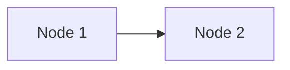

# _Module 0408: What's up with GitHub and Open Educational Resources?_

[GitHub](https://github.com) is a web-based repository for all kinds of projects. One of the original purposes of `GitHub` is for coding. However, it is also well suited to any text-based content. If OER (open educational resources) is created in a text-based format, `GitHub` is, potentially, a great place to host the content.

# Getting Started

1.  Go to [GitHub](https://github.com) and sign up for an account or sign in if you already have an account.
2.  Click "New"

That's it! Well, not really. Let us go over the concepts involved.

The term "repository" refers to a resource where:

* It can host a variety of files and folders. In a sense, a repository is similar to a file system.
* The content stored in a repository is revision-controlled.

What does "revision-controlled" mean? It means a lot of things, including the following:

* Changes are tracked. A file can be reverted to an earlier version.
* The current state of a file can be compared to an earlier version to see the differences.
* A repository can be "cloned." This means another party, if permitted, can duplicate all the files of a repository.
* Multiple parties can simultaneously make changes to even the same files as long as the changes are not conflicting.
* A version can be "forked." This creates multiple versions of the repository so that the changes made to each branch stay independent from each other.
* Branches of a repository can be "merged", meaning that the changes converge to a single branch.

In addition to providing a web-based method to manage repositories, `GitHub` also offers additional resources. For example, the "Issues" tab of a repository allows others to leave comments. This facilitates a great mechanism for readers/learners to provide feedback. However, "issues" is accessible only to signed-in `GitHub` users. Considering `GitHub` is free, this should not deter a reader/learner from signing up and then reporting issues.

If the readership of an OER item is tech-savvy enough, each reader/learner can "fork" the repository, make a suggested change, and then place a "pull request" to update the main branch of the repository where all browsers see. This is a great method for readers and others to contribute and improve the content of a repository.

## Granularity of a repository

There are no hard-and-fast rules. If the granularity is too fine, then the author ends up with many repositories. This can make projects difficult to maintain. On the other hand, if the granularity is too coarse, then it is difficult for another person to make only one change to a small part of the project. 

At the end of the day, text files are relatively small. If the OER is in book form, then it makes sense that each book has a repository. However, if the OER is in smaller independent modules, then a single repository to host all the modules makes sense.

## Naming of a repository

For others to quickly locate content, it is best not to make the name of a repository too complex. The URL to a single file of a repository contains the author's account name as well as the name of the repository. Therefore, there is no need to duplicate these components in the name of a file in a repository.

# Learn Markdown!

[Markdown](https://www.markdownguide.org) is essentially a simple, text-only, and intuitive mark **up** language. Compared to HTML (hypertext markup language), Markdown is much easier to type, less prone to syntax issues, and far more effective as a language to create text (and beyond!) content.

Markdown has many features that make it suitable for text-based content in many domains. For example, it can handle equations like $E=mc^2$. It can also be used to generate simple graphs like the following:



MarkDown can also syntax highlight code blocks:

```c
int main()
{
  return 0;
}
```

Because Markdown is a text-only markup language, any text editor can edit content! `GitHub` has a decent in-browser editor. It does not have all the fancy spell-check and grammar-check features, however. That being said, it is fairly easy to copy and paste text-only content between fancy desktop editors and the web interface.

Each section is automatically an anchor that a URL can reference. However, you can also additional <a href="#customsanchor">custom anchor</a> using a little bit of HTML code. The special anchor uses the HTML code `<a href="#customanchor">custom anchor</a>`.

You can also have multiline derivations:

$$
\begin{align}
&x+x+x\\ 
=& 2x+x\\ 
=& 3x
\end{align}$$

You can also easily add "special visual sections" in the flow of the main text.

---

> [!NOTE]
> Salt dissolves faster in hot water.

---

> [!WARNING]
> This is a warning.

---

> [!TIP]
> Use a microwave oven to quickly heat up water.

---

> [!CAUTION]
> The water is hot!

---

> [!IMPORTANT]
> Don't pour hot water on yourself!

---

# Other fancy but easy features

## Flashcards

You can use the `<detail>` element in HTML. Let's take a look at the following Markdown/HTML code:

```html
<details>
  <summary>Energy equation</summary>
  $E=mc^2$
</details>
```

It is rendered, using GitHub's web interface, as follows:

<details>
  <summary>Energy equation</summary>
  $E=mc^2$
</details>

# To contribute

There are multiple ways to contribute and/or utilize GitHub-hosted OER content.

## Sign up for a GitHub account

First, go to [GitHub](https://github.com), click "Sign up" (upper right corner) and create a GitHub account. This step is necessary for all the methods to contribute to the project. 

## Reporting an issue

1.  Go to any file of the project where an issue is to be reported.
