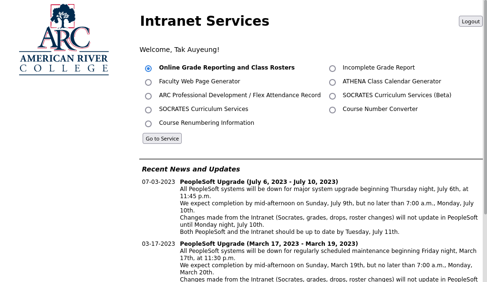
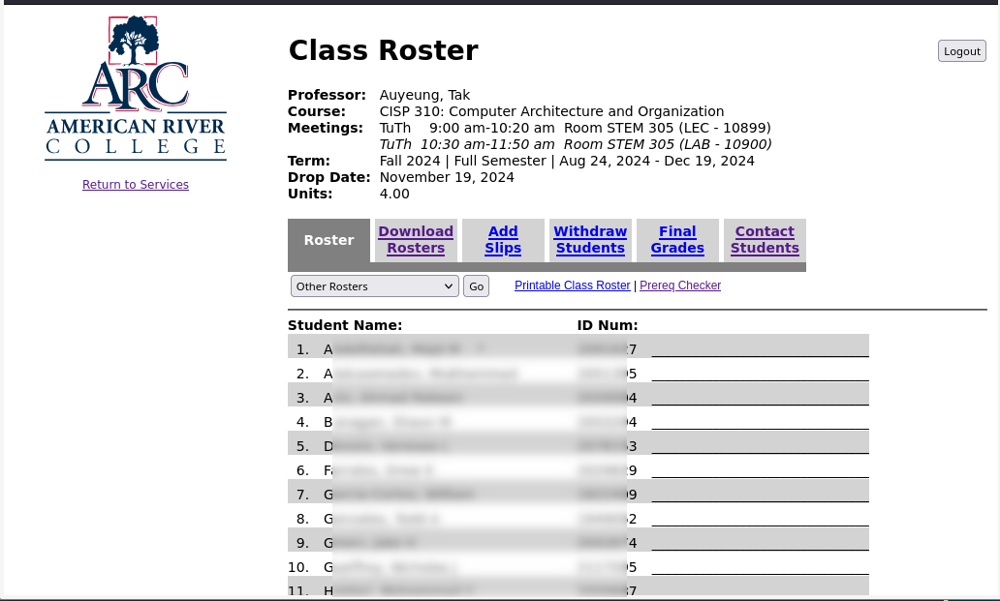
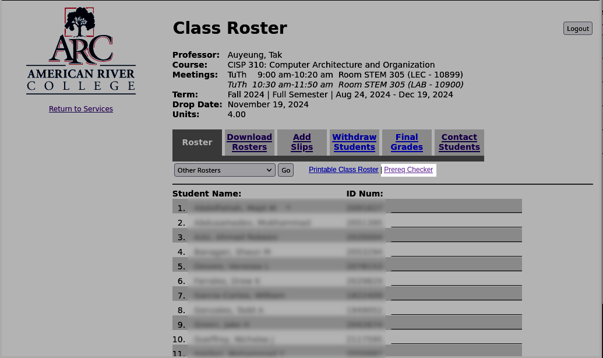
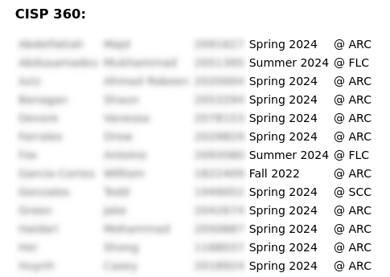
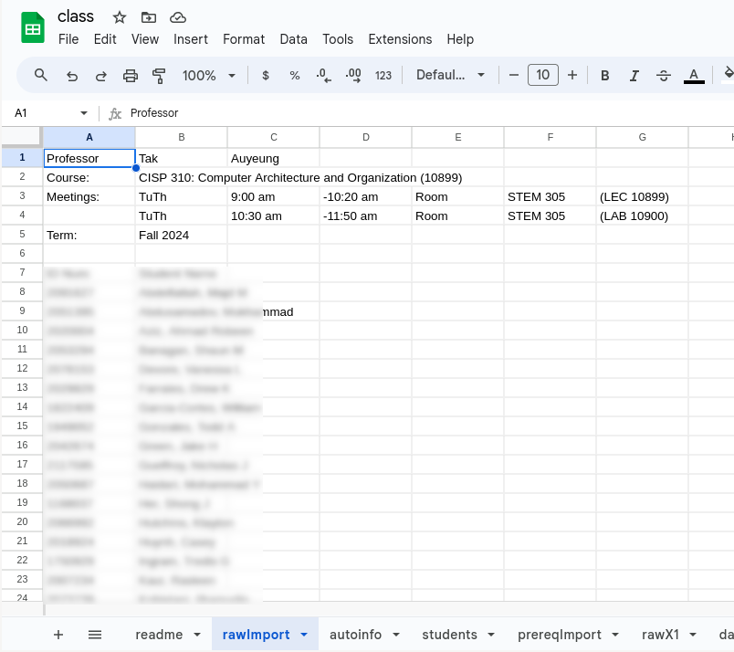
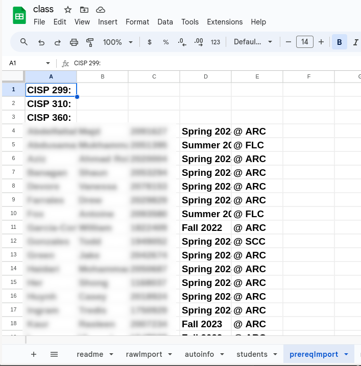
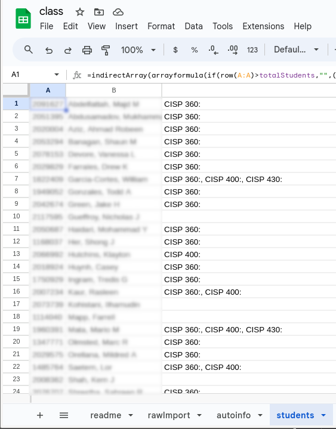

# _Module 0413: Roster Management_

# Accessing class rosters

The Intranet ([https://inside.losrios.edu](https://inside.losrios.edu)) is a Los Rios implemented interface for roster management and curricular management. It will require authentication based on district ID and password. Sign in first. The next page should look like the following.

The first radio button, "Online Grade Reporting and Class Rosters" leads to Roster Management. Click "Go to Service".

Next, sections (classes) will be listed. Click the radio button of the class to be accessed, then click "Get Roster" to access the roster of the selected section. The roster looks like the following:

## Roster Tabs

* Download Rosters: this is the interface to download the roster as a text CSV (comma-separated value) file, or an Excel spreadsheet file.
* Add Slips: This interface shows the permission numbers in a printer-friendly format.
* Withdraw Students: this interface lets the instructor of a section withdraw (drop) students.
* Final Grades: this interface is for entering the final (letter) grades at the end of a section or semester.
* Contact Students: This interface offers options for contacting students. This is particularly useful before students in Canvas shells.

# Prerequisite checking

Except for sections in certain disciplines, prerequisite checking is not performed automatically in enrollment. This means students who have not met the prerequisite requirements can still enroll in sections. It is the instructor's responsibility of a section to enforce prerequisite requirements.

## The Manual Method

In the "Roster" tab, there is a link labeled "Prereq Checker".

This link leads to the *immediate* prerequisite checker. While useful, the immediate prerequisite checker does not take into consideration that some students may transfer from another college, and have taken courses that supersedes the immediate prerequisite requirement. As a result, it is more effective to click the link labeled "Indirect Prerequisite Checker." The *Indirect* Prerequisite Checker page shows every possible way that a student may fulfill a prerequisite requirement. This page is organized by courses that directly or indirectly meet the prerequisite requirements. Each course contains a list of students who have taken that course and passed with a letter grade of C or better. The following is a partial list:

While useful, this approach is still very time-consuming because an instructor needs to check each student to find a match.

## The Semi-Automatic Method

Tak Auyeung developed a Google Sheets that can save some time. To use this Google Sheets:

1.  Go to [the public folder of the CIS Department Shared Drive](https://drive.google.com/drive/folders/1ovfVdLY5A7sy3VInp90tqKkoYRlMU37Z?usp=drive_link).
2.  Open "class" Google Sheets, then use the "file" menu to select "Make a copy".
     3.  Select a destination folder that you have write access.
     4.  Navigate to your own copy of the "class" Google Sheets.
1.  Download the roster as a text CSV file. See the earlier part of this document for instructions.
2.  Import this CSV file into "rawImport" sheet.
     3.  Click "File" to access the file menu,
     4.  Click "Import", this leads to the import dialog. Click "Upload".
     5.  Use "Browse" to open a file browser, then navigate and select the CSV file saved earlier.
     6.  For "Import location", choose "Replace Current Sheet" (this assumes that "rawImport" is the sheet currently being viewed).
     7.  For "Separator Type", the default is fine.
     8.  Uncheck "Convert text to numbers, dates and formulas."
     9.  Click "Import data."
10. Navigate to the prereqImport sheet
11. Copy-and-paste the Indirect Prereq Checker page.
     12. Only copy and paste starting with the first course

When this is done, the "rawImport" sheet should look similar to the following:

The "prereqImport" sheet should look like the following:

> [!Important]
>
> Note that if you are *updating*, you should first delete all cell content of the "prereqImport" sheet before pasting the new content.

With all the information imported and copied and pasted, select the "students" sheet, it should look similar to the following:

If column C is empty for a student, that means there is no evidence from classes taken in Los Rios that the student has met one or more of the prerequisite requirements of a course.

