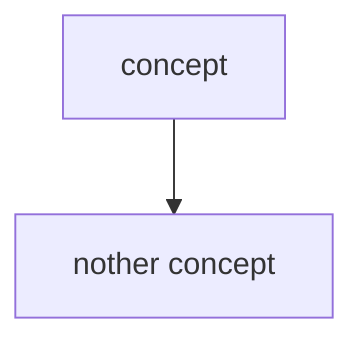
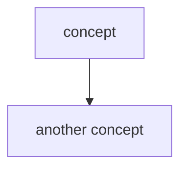
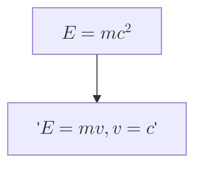

# _Module 0414: GitHub Markdown OER for students_

# What is this?

While Tak has always used OER (Open Education Resource), the material is now being converted to Markdown, managed as a GitHub repository.

* Markdown: Markdown is a mark-up language. GitHub implements its dialet of [Markdown](https://docs.github.com/en/get-started/writing-on-github/getting-started-with-writing-and-formatting-on-github/basic-writing-and-formatting-syntax). You can also reference the full [GitHub Markdown specification](https://github.github.com/gfm/). 
* GitHub: GitHub is a cloud-based repository that is available for free with some conditions attached. A repository is a resource to store files with revision control. There are several ways to access a repository.
  * [https://github.com](https://github.com) This is the primary interface to interact with a repository. The main purpose of this interface is to manage the repository. This interface has limited capability to edit and preview Markdown files.
  * [https://github.dev](https://gibhub.dev) This is an experimental web-based VSCode interface. The editing and previewing abilities are more advanced. However, the Grammarly browser plug-in does not work in the editor.
  * [https://proftak.github.io/modules](https://proftak.github.io/modules) This is the *publication* interface. All Markdown documents are rendered as HTML documents. This interface is useful for publishing content. It is easy to print from this interface.
* Revision control: depending on the repository, there are many actions associated with revision control. GitHub is the de facto standard of cloud-based revision control using the utility program `git`. As an overview, GitHub offers the following:
  * Automatic conversion from Markdown to HTML. This feature is utilized so that all the resources are viewable in a web browser.
  * Markdown files can be downloaded. This is because the repository is public.
  * Any GitHub registered user can "edit in place." This automatically creates a new branch from the MAIN branch that everyone accesses by default.
  * A branch can remain independent permanently.
  * Revisions of the MAIN branch can be applied to a branch so that the branch incorporates the latest enhancements.
  * A branch can be merged to the MAIN branch, this makes it easy for any to contribute revisions and improvements.
  * GitHub provides a means to report issues and facilitate discussions. This allows people who do not wish to make changes to the repository to make suggestions.

# What does it mean to students?

* Free, as in free beer. The content is free of charge.
  * You can download and/or print the content without worries of copyright infringement.
* Free, as in freedom. Everyone has permission to make changes. However, please observe the Creative Commons licence as specified in the [LICENCE](../LICENCE) document.
  * You can make changes, and add your notes to the documents.
  * You can share the content with anyone, except for commercial purposes.

# Suggestions

## Learn Markdown

Markdown is an intuitive markup language. A paragraph looks like a paragraph without distracting HTML syntax.

## Choose a Markdown editor

### Web-based editors/previewers

There are a few options. The default text editor of [https://github.com](https://github.com) is sufficient, but the built-in previewer does not render more advanced HTML code.

The experimental [https://github.dev](https://github.dev) web-based VSCode interface is more advanced, and the previewer does render HTML elements.

### Installed (free) editors/previewers

* [Obsidian](https://help.obsidian.md/Getting+started/Download+and+install+Obsidian)
* [Joplin](https://joplinapp.org/)

## Annotate in your own "copy"

### Getting your copy

You can get your own copy of the content via different ways:

* Download the "raw" file.
  * After you download the Markdown file, you can use a variety of tools to edit it:
    * [Obsidian](https://help.obsidian.md/Getting+started/Download+and+install+Obsidian)
    * [Joplin](https://joplinapp.org/)
* Sign in to GitHub and edit-in-place, creating your own branch, but the original repository.
* Clone the entire repository and manage *your own* repository any way you want, as long as the Creative Commons licence is observed.

### Formatting your annotations

Once you have your own copy of the content, you can add your own notes. To make your notes stand out, you can utilize GitHub Markdown [alerts](https://docs.github.com/en/get-started/writing-on-github/getting-started-with-writing-and-formatting-on-github/basic-writing-and-formatting-syntax#alerts). 

Note that some formatting may only be effective in certain editors/previewers. 

<span style="color: red">You can use colors.</span> This is created using the following HTML `span` tag.

```html
<span style="color: red">You can use colors.</span>
```

<div style="color: blue">You can define an HTML `div` element and choose a color for it.</div>


```html
<div style="color: blue">You can define an HTML `div` element and choose a color for it.</div>
```

<div style="border: 5px solid green">
You can define an HTML `div` element and choose a colored border for it.
</div>

```html
<div style="border: 5px solid green">You can define an HTML `div` element and choose a colored border for it.</div>
```

<div style="border: 1px solid black; float: right; width: 50%">You can define an HTML `div` element and float it to the right.</div>

```html
<div style="border: 1px solid black; float: right; width: 50%">You can define an HTML `div` element and float it to the right.</div>
```


### Graphs

Markdown often implements [Mermaid](https://mermaid.js.org/). Mermaid is a plain-text markup language to describe a variety of graphs, such as flowcharts. This can be a valuable tool for individuals who benefit from visual representation.

To start, let's make a simple graph using the following markdown code

````markdown

````



You can even get fancy and include equations in a graph. This feature is supported by Mermaid 10.9.0 and later, but earlier versions of Mermaid does not support this.

````markdown

````


