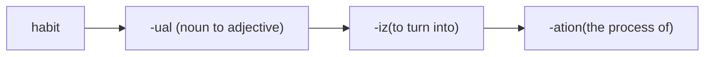

# _Module 0417: Time Budgeting and Management for College Students_

# What is this?

This short article/module introduces time budgeting and management in the context of college students.

With time budgeting and management, a student can minimize, not necessarily totally eliminate, missing deadlines and/or forgetting important dates. 

# Time budgeting

We only have 24 hours per day, 7 days per week. Individuals have varying obligations, hobbies, interests, etc. It is important to understand with a mix of education, family, career, leisure, etc., there is enough time to go around. 

Running out of time causes anxiety and even panic. Anxiety negatively impacts cognitive capacity. Cognitive capacity is essential to learning. Underestimating time budget, therefore, can directly impact academic performance.

## A laundry list

The key to budgeting is an accurate estimate of activities that take time. The main categories include the following:

* Education: in-class time, out-of-class time, commute, study groups, tutoring, etc.
* Rest and self-care: sleep, nap, meditation, breaks, support groups, etc.
* Family: meals, or just simple family time.
* Community: religious gatherings, worship, spiritual exploration, etc.
* Career: work, commute.
* Hobbies: gardening, hiking, sports, etc.
* Friends: hanging out, and doing things together, may overlap with hobbies!

## Time-logging

Log your time usage to get an estimate. Maintain a diary of what you do and how long it takes for a week or longer. This gives you an idea of how much time you *currently* spend on each category list in the [previous](#a-laundry-list] section. In the log, you do not need to identify the category, just write down the start and end time of each activity and give it a brief description. You can categorize when you need to add up the durations.

## Education related time usage

A lecture unit is 18 hours of lecture time in a semester system. For each hour in lecture, a student is expected to spend two additional out-of-class hours studying, doing homework, reviewing notes, etc. As a result, a typical 3-unit class needs $3 \times 18 \times (1+2) = 108$ hours. If a 3-unit class spans 16 weeks, then the class requires $\frac{108}{16}=6.75$ hours per week, on average.

A full-time job consists of 40 work hours per week, excluding commuting. Generally speaking, this leaves enough time for most people for family, leisure, community, etc. $\frac{40}{6.75} \approx 6$. Using this calculation, taking 6 3-unit classes in a 16-week semester is about the same, in time usage, as a full-time job.

## Buffering

Because how running out of time can negatively impact academic performance, and also to allow for some unplanned events, it is important to over budget. Instead of taking 6 3-unit classes, taking 5 3-unit classes provides a buffer.

"but then it will take longer to graduate!"

The flip side is an optimal (tight) budget that does not leave any buffer. Life happens, there are always unplanned events that take time. Not planning for unforeseen events can result in running out of time, causing anxiety, impacting academic performance, and *potentially* necessitating retaking a class. One can think of the over budget of time as an insurance premium. If nothing happens, it *appears* the premium is going to waste. However, insurance is a risk management mechanism to manage loss due to unforeseen events. 

# Time management

With a budget, effective management is necessary to make the most of a resource. In this case, time is the resource.

Effective time management varies depending on the individual. For example, people diagnosed with ADHD may need a strategy that is significantly different from people with a high level of conscientiousness. While no universal time management strategy works for everyone, each individual is responsible to derive a time management strategy. Some elements are common to most time management strategies.

## Structure

In this context, "structure" means a repeating pattern. For example, "I will spend 30 minutes before (in-person) class to review concepts covered in the previous class." This is structured because an in-person class meets on specific days at specific times in a specific classroom. Structure brings *contextual* cues that help the mind work more efficiently. This is why changing a classroom for an exam often leads to worse outcomes for most people.

For in-person classes, it is beneficial to schedule time for homework, studying, and revision of notes *close* to the lecture time, preferably before another class. This is because the mind can only hold connections between concepts for a period of time.

While online classes, especially asynchronous ones, offer a great deal of flexibility, this flexibility can also make it more difficult to structure time usage. 

## Timetable and calendar apps

Some people need a structure more than others. A timetable and putting the timetable in a calendar app can help. This can help to ensure time is used as planned, but the most important benefit is the ability to be *reminded*. This approach also makes it obvious, in the form of time conflict, when an unplanned activity overlaps with a planned activity.

Can an individual play board games with friends in a time slot allocated to studying? Sure, impromptu activities can happen, and it is okay. *Being aware* that "I may need to find another time to make up for studying" is important. Using a calendar to track time usage improves such awareness.

Another benefit of using a calendar, especially an app, is the reminder feature. [Canvas events can be synced with Google Calendar](https://community.canvaslms.com/t5/Student-Guide/How-do-I-subscribe-to-the-Calendar-feed-using-Google-Calendar-as/ta-p/535). This is just an example of how to integrate school work into a calendar that also includes personal events. It is best to have a single view of all events in order to spot double-booking and time conflicts.

# Short-term (week/day) planning

Time management strategies are, well, strategic. Time budgeting is logistical. That leaves short-term planning "tactical." In other words, the budget makes sure there is enough time, the strategy contributes an effective use of the resource, but the short-term plan allocates the resources to accomplish specific tasks.

Keeping track of the due dates of assignments and dates of exams/quizzes is the first step. This is also why integrating the events from an LMS (learning management system, such as Canvas) into a calendar app is important.

## ASAP vs JIT

ASAP (as soon as possible) versus JIT (just-in-time) are two doctrines of planning to complete tasks. Few use one of the two doctrines exclusively.

People who are highly ranked in conscientiousness use ASAP often. However, people diagnosed with ADHD *also* use ASAP, but only on tasks that are of interest. ADHD often results in the use of JIT on everything that is not of interest.

Another possibility is a blend of the two doctrines: start early, finish on time (SEFOT, I just invented this acronym!). This blend allows some flexibility to interleave tasks.

Regardless of ASAP, JIT, or SEFOT, it is crucial to track:

* What needs to be done,
* When does it need to be done,
* How long it will take (an approximation), and
* How much of it is completed.

## Task progress tracking

Trying to track all in one's mind is *possible*, but probably not the best way. There is no need to use Microsoft Project to track homework assignments, either. Some people prefer the tactile feel of paper, others prefer using a spreadsheet or a document. Many calendar apps also offer task tracking. The key is: to find a means to track tasks and their status, and try not to rely on memory alone!

An interesting task progress tracking method is a Markdown document, or any document that can use checkboxes in a nested list. This mechanism does not only track the *completion* of a task, it also helps to break down a larger task into its components. Breaking a task into smaller components is essential for people diagnosed with ADHD. The following is an example:

- [ ] English writing. Topic: Career plan. Due date: 10/25
  - [ ] Information that I need
    - [x] Assessment of my interests and aptitudes
    - [ ] Use the BLS career outlook site to come up with a list of suitable careers
  - [ ] Actual paper writing
    - [x] Brief introduction to myself
    - [ ] What career I have chosen
      - [ ] Why this career is a good fit
      - [ ] Quote supporting data

This is just an example! Individuals may have vastly different, even contrasting, methods to track task progress. 

# Example of workflow

* Before a semester: enroll in 5 3-unit classes (instead of 6 or more).
* Before a semester: develop a timetable, an entry may read "15-minute break after CISP 310 lecture, then go to the library to study for 90 minutes." Optionally, encode this in a calendar.
* During a semester: put all homework assignments, quizzes, exams, etc. in the calendar, and optionally specify a sufficient lead time for notifications.
* In each morning during a semester: check the calendar for events and tasks, and look ahead 7 to 10 days.
* During the time slot for "CISP 310 studying",
  * Open the task tracker for CISP 310.
  * Evaluate tasks.
  * Prioritize tasks with immediate or close due dates.
  * After the completion of a task or subtask, check it in the task tracker
* Put everything on the calendar, including leisure activities, family obligations, etc. This helps to visualize time usage as well as time conflict.

# Habitualization

Making a habit of checking the calendar and task tracking is the key to the consistent and effective application of time management. 

An excellent book to read is ["The Power of Habit: Why We Do What We Do in Life and Business."](https://a.co/d/6GP9K8b). To summarize, a habit has the following components:

* A cue. This is a sensation acting as a subconscious reminder. This can be the smell of coffee in the morning, the sight of the hallway after a class, etc.
* A routine. This is the action. In the context of this module, it can be checking the calendar, opening the task tracker, etc.
* A reward. This is the reinforcement of the habit. It can be the enjoyment of the coffee, visually seeing checkboxes checked in the task tracker, a small ritual to celebrate the completion of a task, etc.

[ChatGPT has this say on this topic.](https://chatgpt.com/share/f0cd65ef-4acd-4fe7-afba-690d63325aba).

